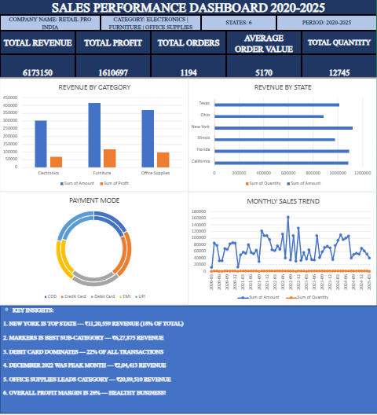

# 📊 Sales Performance Dashboard — Excel

## Project Overview
Analysed 1,194 sales orders across 6 US states 
and 3 product categories using Microsoft Excel.

## Tools Used
- Microsoft Excel
- Pivot Tables
- VLOOKUP & XLOOKUP
- Data Cleaning
- Charts & Visualization
- KPI Dashboard Design

## Key Insights
1. New York is top performing state — ₹11,20,559
2. Office Supplies leads all categories — ₹20,89,510
3. Debit Card most preferred payment — 22%
4. December 2022 was peak sales month — ₹2,04,413
5. Overall profit margin is 26% — Healthy!

## Dashboard Preview

## Dataset Details
- Total Orders: 1,194
- Period: 2020-2025
- Categories: Electronics | Furniture | Office Supplies
- States: California | Florida | Illinois | 
          New York | Ohio | Texas
